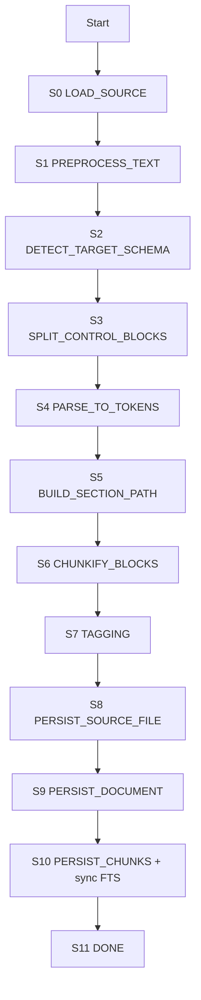

# FSM Pipeline: Markdown → Chunks → tags_text → SQLite(FTS5)

Контекст: pipeline индексирует медицинские документы (в основном markdown), разбивает их на логические чанки и строит FTS5-индекс по чанкам.

Документ фиксирует **многошаговый пайплайн в виде FSM** (finite state machine) для:
- chunking на базе `markdown-it-py`
- формирования `tags_text` (токенизация/нормализация/алиасы)
- сохранения `documents/chunks` и индексации `chunks_fts` (FTS5)

## Список шагов FSM

S0 — LOAD_SOURCE  
S1 — PREPROCESS_TEXT (нормализация, sha256)  
S2 — DETECT_TARGET_SCHEMA (**новый шаг**)  
S3 — SPLIT_CONTROL_BLOCKS (выделение schema строки, metadata блока, md_body)  
S4 — PARSE_TO_TOKENS (markdown-it-py)  
S5 — BUILD_SECTION_PATH  
S6 — CHUNKIFY_BLOCKS  
S7 — TAGGING (deterministic, tags_text без чисел/единиц)  
S8 — PERSIST_SOURCE_FILE (новый)
S9 — PERSIST_DOCUMENT
S10 — PERSIST_CHUNKS (внутри обновляет FTS; бывшие S9+S10)
S11 — DONE

## Общая модель данных между шагами

Между шагами передаётся **один мутабельный объект `ctx`**, который модифицируется in-place.

Минимально важные поля `ctx`:
- source_path
- raw_text
- sha256
- target_schema (+ audit)
- md_body
- metadata_dict (optional)
- md_tokens
- chunks
- document_id
- stats/warnings/errors

---

## 0) FSM: перечень шагов (SagaStep) пайплайна

# S0 — LOAD_SOURCE

## Цель
Загрузить содержимое файла как текст, не делая логических преобразований (кроме базового чтения).

## Вход
- `ctx.source_path`

## Выход (в ctx)
- `ctx.raw_text` (строка как прочитали)
- `ctx.file_ext` (только для аудита/логов)
- `ctx.stats`/`ctx.warnings` инициализированы (если не инициализированы ранее)

## Алгоритм
1) Определить расширение файла (pathlib suffix) → `ctx.file_ext`.
2) Прочитать файл:
   - encoding: UTF-8 strict
   - если UTF-8 не подходит — ошибка (у вас строгая политика качества).
3) Сохранить строку как есть в `ctx.raw_text`.

## Опционально / особенности
- Исключения:
  - `E_READ_FAIL` (fatal): файл не читается
  - `E_DECODE_FAIL` (fatal): не UTF-8
- Примечание: так как вы игнорируете расширение, никаких ветвлений “md/txt” здесь не делаем.

---

# S1 — PREPROCESS_TEXT (нормализация, sha256)

## Цель
Сделать текст детерминированным для дальнейшей обработки и дедупликации:
Обработать текст: унифицировать переносы строк, нормализовать Unicode/регистр, заменить `ё→е`, вычислить sha256.

## Вход
- `ctx.raw_text`

## Выход (в ctx)
- `ctx.raw_text` (уже нормализованный текст)
- `ctx.sha256`

## Алгоритм
1) Нормализовать переносы строк:
   - заменить `\r\n` и `\r` на `\n`.
2) Unicode normalization: привести к `NFKC`.
3) Привести к нижнему регистру (`lower()`).
4) Заменить нетиповые символы, такие как например `ё` на `е`.
5) Вычислить `sha256` по нормализованному `raw_text` → `ctx.sha256`.

## Опционально / особенности
- Это влияет на весь последующий pipeline:
  - markdown-it будет парсить уже lower-case документ;
  - если вам критично сохранять оригинальный регистр в `documents.raw_text`, можно хранить два поля:
    - `raw_text_original`
    - `raw_text_normalized`
  Сейчас спецификация подразумевает, что `raw_text` — уже нормализованный.
- Исключения: как правило нет (если raw_text есть).

---

# S2 — DETECT_TARGET_SCHEMA

## Цель
Определить `target_schema` строго из заголовка `Target Schema ID:` (без эвристик).

## Вход
- `ctx.raw_text`

## Выход (в ctx)
- `ctx.target_schema` ∈ {lab, diagnostic, consultation}
- `ctx.schema_confidence = "exact"`
- `ctx.schema_source = "header"`
- `ctx.schema_header_line` (оригинальная найденная строка)

## Алгоритм
1) Взять первые `N` строк (например 30) из `ctx.raw_text`.
2) Найти строку по шаблону: `target schema id:\s*(\w+)` (в lower-case она уже будет такой).
3) Если найдено:
   - value должен быть одним из `lab|diagnostic|consultation`.
   - записать в ctx.
4) Если не найдено → fatal.
5) Если найдено, но значение не из списка → fatal.

## Опционально / особенности
- Исключения:
  - `E_NO_SCHEMA_ID` (fatal)
  - `E_SCHEMA_INVALID` (fatal)
- Последствие вашей policy “игнорировать расширение”: `.txt` тоже обязан содержать `Target Schema ID:`.

---

# S3 — SPLIT_CONTROL_BLOCKS

## Цель
Отделить markdown-тело документа от метаданных:
- убрать строку `Target Schema ID: ...` из тела, чтобы не индексировать,
- опционально выделить `metadata:` блок (и также не индексировать).

## Вход
- `ctx.raw_text`
- `ctx.target_schema`

## Выход (в ctx)
- `ctx.md_body` (текст для markdown-it, без schema строки и без metadata блока)
- `ctx.metadata_dict` (optional; best-effort)

## Алгоритм
1) Удалить из текста строку `target schema id: ...` (обычно первая/в первых строках).
2) Поиск `metadata` блока:
   - целевой паттерн ваших файлов: после `---` идёт `metadata:` и YAML-подобные строки до конца документа.
   - если найден:
     - попытаться распарсить в dict (best-effort)
     - вырезать из md_body целиком от `metadata:` до конца (включая разделитель `---`, если он служит только для metadata)
3) Результат сохранить в `ctx.md_body`.

## Опционально / особенности
- metadata используется только как дополнительный источник структурных тегов (опционально).
- Исключения:
  - `E_METADATA_PARSE` (recoverable → warning): metadata найден, но не распарсился; при этом md_body всё равно должен исключить metadata блок.

---

# S4 — PARSE_TO_TOKENS (markdown-it-py)

## Цель
Преобразовать `md_body` в поток токенов Markdown (AST-токены), чтобы chunking был стабильным и не regex-ориентированным.

## Вход
- `ctx.md_body`

## Выход (в ctx)
- `ctx.md_tokens`

## Алгоритм
1) Инициализировать markdown-it-py с включенными:
   - headings
   - lists
   - tables (обязательно)
2) Вызвать парсер на `ctx.md_body`.
3) Сохранить список токенов в `ctx.md_tokens`.

## Опционально / особенности
- Исключения:
  - `E_MD_PARSE_FAIL` (fatal)
- Комментарий: markdown-it-py обычно не падает на “просто тексте”, но политика у вас строгая.

---

# S5 — BUILD_SECTION_PATH

## Цель
Построить контекст (breadcrumbs) для каждого блока: `section_path` и `heading`.
Это не создаёт чанки само по себе, а готовит данные для S6.

## Вход
- `ctx.md_tokens`

## Выход (в ctx)
Один из вариантов (на выбор реализации):
- либо `ctx.block_events = [...]` (не обязателен в ctx, можно стримить),
- либо обновлённая структура для S6.
Спецификационно важно: S6 должен уметь получить `(section_path, heading)` для каждого блока.

## Алгоритм
1) Вести стек заголовков `H = []` с элементами `(level, title)`.
2) При встрече heading:
   - определить level 1..6
   - извлечь title (inline text)
   - pop пока last.level >= level
   - push (level, title)
3) Для каждого блочного токена (table/list/paragraph) вычислять:
   - `section_path = " > ".join(title for _, title in H)`
   - `heading = последний title` (или None, если нет заголовков)

## Опционально / особенности
- Если в документе нет заголовков вовсе:
  - heading можно подставить из имени файла (но лучше считать это плохим входом; однако у вас это не запрещено).
- Ошибки: нет (если токены есть).

---

# S6 — CHUNKIFY_BLOCKS

## Цель
Превратить markdown-блоки в “атомарные” чанки для FTS retrieval.

## Вход
- `ctx.md_tokens`
- доступ к `section_path/heading` логике (из S5)

## Выход (в ctx)
- `ctx.chunks: list[Chunk]`
- `ctx.stats["chunks_total"]`
- `ctx.stats["chunks_by_kind"] = {table: N, list: N, fact: N, section: N}`

## Алгоритм
Для каждого блочного элемента markdown (с его section_path/heading):

1) Если блок — TABLE:
   - создать chunk(kind="table", text=markdown_table_block)
2) Если блок — LIST:
   - создать chunk(kind="list", text=markdown_list_block)
3) Если блок — PARAGRAPH:
   - проанализировать inline-содержимое: начинается ли paragraph с паттерна `**Label**:`
     - если да → kind="fact"
     - иначе → kind="section"
   - text = исходный paragraph (в markdown или plain; лучше markdown)
4) Если chunk(kind="section") слишком длинный:
   - split по абзацам (разделитель: пустая строка)
   - каждый абзац становится отдельным chunk(kind="section")
5) Собрать chunks в порядке появления (chunk_no будет присвоен при persist).

## Опционально / особенности
- Почему `fact` важен: в ваших ФГДС/Колоноскопия/УЗИ простаты “Клиническое значение” оформлено как `**Тема**: ...` — это идеальные “микро-чанки”.
- Исключения:
  - `E_EMPTY_CHUNKS` (fatal): если по итогу список чанков пуст.

---

# S7 — TAGGING (deterministic, tags_text без чисел/единиц)

## Цель
Сформировать `tags_text` для каждого чанка — строку токенов для FTS, усиливающую поиск за счёт:
- структуры (doc_type, section_path),
- алиасов/аббревиатур (детерминированный словарь),
- опциональных meta tags.

Важно: tags_text **не дублирует** chunk.text, он дополняет.

## Вход
- `ctx.target_schema`
- `ctx.chunks`
- `ctx.metadata_dict` (optional)

## Выход (в ctx)
- каждый chunk получает `tags_text: str` (in-place)
- (optional) `ctx.stats["tags_tokens_total"]`

## Алгоритм (на уровне концепции)
Для каждого chunk:

1) Собрать источники токенов:
   - `doc_type` = ctx.target_schema
   - `chunk_kind`
   - `section_path` (разбить на токены)
   - `heading` (разбить на токены)
   - `metadata.tags` (если есть)
2) Tokenize:
   - дефисы: `a-b` → `a`, `b`, `ab`
   - слэши: `a/b` → `a`, `b`
   - скобки: сохраняем токены внутри
   - пунктуация → разделитель
   - стоп-слова удаляем (только для tags_text)
   - **числа/единицы выбрасываем полностью**
3) Alias expansion:
   - если встретили токен из alias-map (например `птг`, `фгдс`, `лпнп`) → добавить связанные токены (`pth`, `эгдс`, `ldl`, …)
4) Deduplicate:
   - set, затем сортировка (для стабильности)
5) Join:
   - `" ".join(tokens_sorted)` → tags_text

## Опционально / особенности
- Нормализация lower/NFKC/ё→е уже выполнена в S1, поэтому TAGGING не повторяет её.
- Ошибки: нет (если alias-map пустой — просто меньше качества поиска).

---

# S8 — PERSIST_SOURCE_FILE

## Цель
Сохранить исходный markdown в файловое хранилище и получить стабильный `source_path` (ключ).

## Вход
- `ctx.source_path` (локальный путь к файлу) или `ctx.raw_text`
- `ctx.sha256` (вычислен в S1)
- `ctx.target_schema` (опционально, для раскладки по папкам)

## Выход (в ctx)
- `ctx.canonical_source_path` — путь/ключ в файловом хранилище
- (опционально) `ctx.stats[“source_saved”]=True`

## Алгоритм (MVP)
1) Сформировать ключ: `storage_key = “{doc_type}/{sha256}.md”`.
2) Записать файл идемпотентно: если уже есть — пропустить.
3) Сохранить `storage_key` как `ctx.canonical_source_path`.

## Опционально / особенности
- Если ingestion читает уже из “нормального” хранилища и путь уже является ключом — шаг может быть noop.
- Ошибки:
  - `E_STORAGE_WRITE_FAIL` (fatal)

---

# S9 — PERSIST_DOCUMENT

## Цель
Сохранить запись о документе в `documents` (index + audit). Raw text не хранится — документ живёт в FileStore.

## Вход
- `ctx.document_id` (sha256)
- `ctx.canonical_source_path` (из S8)
- `ctx.sha256`
- `ctx.target_schema`
- audit: schema_confidence/source/header_line

## Выход (в ctx)
- (опционально) `ctx.stats[“document_persisted”]=True`

## Алгоритм
1) Открыть транзакцию SQLite.
2) `INSERT OR REPLACE` в `documents`:
   - `id` = document_id
   - `source_path` = canonical_source_path
   - `source_sha256` = sha256
   - `doc_type` = target_schema
   - `indexed_at` = now()
   - schema audit fields
3) Commit.

## Опционально / особенности
- `raw_text` в `documents` не хранится: полный текст доступен через FileStore по `source_path`.
- Ошибки:
  - `E_DB_FAIL` (fatal)

---

# S10 — PERSIST_CHUNKS

## Цель
Сохранить чанки в `chunks` и атомарно синхронизировать FTS5-индекс в рамках одной транзакции.

## Вход
- `ctx.document_id`
- `ctx.chunks` (уже с tags_text из S7)

## Выход (в ctx)
- `ctx.stats[“chunks_persisted”]=N`

## Алгоритм (replace_document_chunks + SyncFTS, одна транзакция)
1) `DELETE FROM chunks_fts WHERE rowid IN (SELECT chunk_pk FROM chunks WHERE document_id = ?)` — удалить старые FTS-записи.
2) `DELETE FROM chunks WHERE document_id = ?` — удалить старые чанки.
3) Для каждого чанка по порядку:
   - вычислить `chunk_id` (детерминированный хеш от doc_id + section_path + kind + text)
   - присвоить `chunk_no` (0..N-1)
   - вставить: id, document_id, chunk_no, section_path, heading, kind, text, tags_text
4) `INSERT INTO chunks_fts(rowid, text, heading, section_path, tags_text) SELECT chunk_pk, ... FROM chunks WHERE document_id = ?` — синхронизировать FTS.
5) Commit.

Отдельного шага `UpdateFTS` нет: FTS всегда синхронизирован после этой операции.

## Опционально / особенности
- Ошибки:
  - `E_DB_FAIL` (fatal)

---

# Финализация pipeline

## Цель
Финализировать выполнение пайплайна для одного документа.

## Вход
- ctx со всеми результатами

## Выход
- успех (для оркестратора)
- optionally: ctx.stats как итоговый отчёт

## Опционально / особенности
- Оркестратор может логировать:
  - doc_id, schema, chunks_total, chunks_by_kind

---
