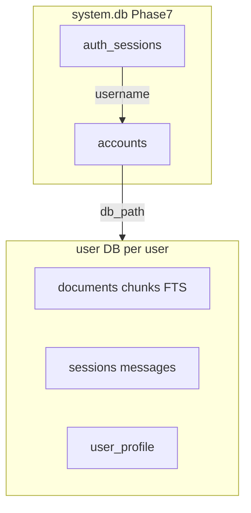
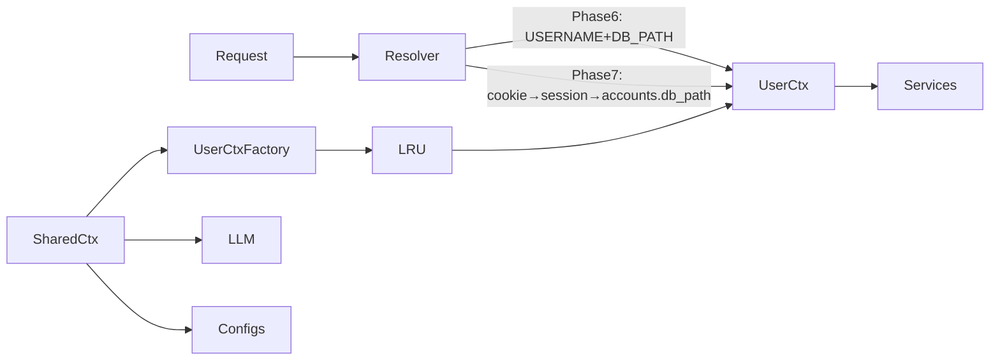
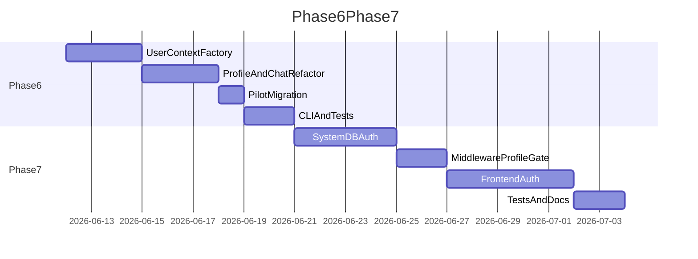

# Phase 6–7 — Per-User Data & Auth: План реализации

## 1. Введение

Документ описывает реализацию **Variant A**: thin **Phase 6** (data layer, pilot migration, isolation tests) → **Phase 7** (username/password auth, protected API, profile edit + blocker). **Phase 5** (Docker, deploy в закрытом контуре) — **после** Phase 6–7; см. [med-ai-adviser-roadmap.md](med-ai-adviser-roadmap.md). Решения зафиксированы в серии grill-me интервью и дополнены ревью плана.

См. также: [med-ai-adviser-roadmap.md](med-ai-adviser-roadmap.md), [phase4-impl-plan.md](phase4-impl-plan.md).

### Что меняется

- Одна SQLite на окружение → **отдельный user DB на пользователя** (KB + sessions + profile).
- Профиль пациента: `config/patient.yaml` → таблица `user_profile` в user DB.
- Phase 7: реестр аккаунтов в **`system.db`**, server-side sessions (cookie), open registration.
- Factory/DI: singleton `AppContext` → **`SharedContext` + per-user `UserContext`** (LRU cache).

### Что остаётся за рамками Phase 6–7

- **Phase 5 (Operations):** Docker, Compose, volume deploy, reverse proxy, VPN/allowlist — **следующая фаза после Phase 7**.
- Email, восстановление пароля.
- Выбор пользователем пути к БД (флешка) — post-Phase 7; архитектура готова через `accounts.db_path`.
- Idle session timeout / `last_seen_at`.
- Rate limiting на login (Phase 9).
- Версионные schema migrations (таблица версий + runner) — при необходимости позже.
- Pin-сессий, streaming, image ingest — без изменений относительно roadmap.

### Отклонение от концепции §7

В концепции указан «email + пароль». Для текущего этапа принято: **`username` + password** (ASCII slug). Email — optional future (Phase 9+). Roadmap §Phase 7 обновить при merge.

---

## 2. Архитектурные решения (grill-me)

| # | Тема | Решение |
|---|------|---------|
| 1 | Delivery | Thin Phase 6 → Phase 7; Phase 6 не multi-user UI |
| 2 | Идентификатор | `username` — immutable ASCII slug; файл БД именуется по `accounts.db_path`, не обязательно `{username}.db` на будущее |
| 3 | User DB layout | Phase 6: env `DB_PATH`; Phase 7 register: `db_path = .data/db/{username}.db` |
| 4 | System DB | Фиксированно `.data/db/system.db` — **только Phase 7** |
| 5 | Pilot Phase 6 | `ingest.db` → `default.db` + seed `user_profile` из `patient.yaml` |
| 6 | Pilot Phase 7 | **`default.db` удаляется**; все пользователи через Register; данные pilot re-ingest |
| 7 | Phase 6 routing (HTTP) | env `USERNAME=default`; web без изменений |
| 8 | Profile storage | Singleton `user_profile` в **user DB**; `system.db` — только accounts + sessions |
| 9 | Auth | argon2id, min 8 chars; server-side `auth_sessions`; **без idle-timeout**; logout = DELETE session |
| 10 | Registration | Open; на dev — localhost; VPN/allowlist при **Phase 5** deploy; reserved: `system`, `default`, `admin` |
| 11 | API perimeter | Hard: публично health + `/api/v1/auth/*`; остальное — cookie |
| 12 | Profile gate | Blocker: chat/documents/sessions недоступны до complete profile |
| 13 | Schema | Idempotent `CREATE IF NOT EXISTS`; без version table |
| 14 | CLI | `--username` + `--db`; env `USERNAME` + `DB_PATH` |

### 2.1. Username validation

- Regex: `^[a-z][a-z0-9_-]{2,31}$` (3–32 символа, lowercase).
- Reserved (409 `username_reserved`): `system`, `default`, `admin`.
- Immutable после регистрации.

### 2.2. Profile completeness

**Обязательные поля:** `name` (non-empty), `age > 0`, `sex` (non-empty), `date_of_birth` (non-empty, ISO `YYYY-MM-DD`).

**Необязательные:** `chronic_conditions`, `current_medications`, `allergies` — пустые списки допустимы.

**Вычисление:** `ProfileService.is_complete(profile) -> bool`; поле `is_complete` в `ProfileDTO` и `GET /auth/me`.

**Phase 6:** после migration pilot profile **complete** — gate не применяется (gate только Phase 7).

### 2.3. USERNAME и DB_PATH (Phase 6 / CLI)

Единое правило резолва пути к user DB:

1. `username = os.getenv("USERNAME", "default")`.
2. Если задан `DB_PATH` — использовать его как путь к user DB.
3. Иначе `db_path = f".data/db/{username}.db"`.

`USERNAME` — логический идентификатор (логи, isolation tests); при явном `DB_PATH` пара может не совпадать с именем файла — **допустимо для dev**. В production pilot: `USERNAME=default`, `DB_PATH=.data/db/default.db`.

### 2.4. Уточнение к Phase 4 «сервисы не меняются»

HTTP wiring и factory меняются полностью. **Исключение — `ChatService`:** сейчас принимает `PatientInfo` snapshot в конструкторе ([`src/services/chat.py`](../../src/services/chat.py)); после PATCH профиля snapshot устареет. **Обязательный рефакторинг:** `ChatService` получает `ProfileService` и вызывает `get_profile()` **на каждый turn** (или async getter). Сигнатура конструктора меняется — это сознательное исключение.

---

## 3. Целевая архитектура

### 3.1. Две SQLite



| Файл | Содержимое | Когда |
|------|------------|-------|
| `.data/db/system.db` | `accounts`, `auth_sessions` | Phase 7+ |
| `.data/db/{username}.db` (default path) | KB, sessions, profile | каждый user |
| `.data/db/default.db` | pilot после Phase 6 | удаляется при Phase 7 deploy |

### 3.2. Runtime context



**`SharedContext`** (lifespan, один на процесс):

- LLM client, chat/retrieval/ingest configs, prompt templates.
- `SystemStore` / `AuthService` (Phase 7).
- `UserContextFactory` с LRU-кэшем по ключу `(username, db_path)`.

**`UserContext`** (per resolved user):

- `SqliteKnowledgeStore`, `SqliteInternalStore`, `SqlStore`.
- `ProfileService`, `SessionsService`, `ChatService`, `IngestService`, `DocumentsService`.

**Новые модули:**

- [`src/api/user_context.py`](../../src/api/user_context.py) — dataclass `UserContext`, factory.
- [`src/api/user_resolver.py`](../../src/api/user_resolver.py) — `resolve_user_context(request)`.

[`src/api/deps.py`](../../src/api/deps.py): `get_user_context(request) -> UserContext`; роутеры берут сервисы из `user_ctx`.

### 3.3. Phase 6 vs Phase 7 resolver

| Источник | Phase 6 HTTP | Phase 6 CLI | Phase 7 HTTP | Phase 7 CLI |
|----------|--------------|-------------|--------------|-------------|
| username | `USERNAME` env | `--username` / env | cookie → session | login или env |
| db_path | §2.3 | `--db` / env | `accounts.db_path` | lookup или `--db` override dev |

Phase 7 HTTP: **нет fallback** на env `USERNAME`/`DB_PATH`.

---

## 4. Схемы БД

### 4.1. User DB — дополнение [`schema.sql`](../../src/store/sql/schema.sql)

```sql
CREATE TABLE IF NOT EXISTS user_profile (
    id INTEGER PRIMARY KEY CHECK (id = 1),
    name TEXT NOT NULL DEFAULT '',
    age INTEGER NOT NULL DEFAULT 0,
    sex TEXT NOT NULL DEFAULT '',
    date_of_birth TEXT NOT NULL DEFAULT '',
    chronic_conditions_json TEXT NOT NULL DEFAULT '[]',
    current_medications_json TEXT NOT NULL DEFAULT '[]',
    allergies_json TEXT NOT NULL DEFAULT '[]'
);
```

- Singleton: одна строка `id = 1`.
- Списки — JSON в TEXT (как `tool_calls_json` в messages).
- `ensure_schema(db_path)` — idempotent; на существующем `ingest.db` после copy добавляет таблицу.

**Store:** методы в [`SqliteInternalStore`](../../src/store/sql/sqlite_internal_store.py) или отдельный `ProfileStore` protocol (optional, для чистоты domains).

### 4.2. System DB — новый [`system_schema.sql`](../../src/store/sql/system_schema.sql) (Phase 7)

```sql
CREATE TABLE IF NOT EXISTS accounts (
    username TEXT PRIMARY KEY,
    password_hash TEXT NOT NULL,
    db_path TEXT NOT NULL,
    created_at TEXT NOT NULL
);

CREATE TABLE IF NOT EXISTS auth_sessions (
    session_id TEXT PRIMARY KEY,
    username TEXT NOT NULL REFERENCES accounts(username) ON DELETE CASCADE,
    created_at TEXT NOT NULL
);
```

`db_path` хранится **как строка** (relative или absolute) — задел под user-chosen path post-Phase 7.

### 4.3. Миграции схемы

Полноценный migration runner **не вводится**. Изменения — через `CREATE IF NOT EXISTS` + idempotent data scripts. Резервная копия `.data/db/` перед deploy обязательна (операционная практика).

---

## 5. Phase 6 — Per-User Data (thin)

**Roadmap-критерий выхода:** два пользователя не видят чужие документы и чаты; ingest/chat в контексте выбранного user DB.

**Scope:** data layer, profile в DB, pilot migration, CLI, isolation tests. **Не в scope:** `system.db`, auth, frontend.

### Этап 6.1 — UserContext factory

**Файлы:** `user_context.py`, `user_resolver.py`; рефакторинг [`factory.py`](../../src/api/factory.py), [`deps.py`](../../src/api/deps.py), [`app.py`](../../src/api/app.py) (`app.state.shared_ctx`).

**Задачи:**

1. Выделить `SharedContext` из текущего `AppContext`.
2. `UserContextFactory.get(username, db_path)` — создаёт/берёт из LRU stores + services.
3. `ensure_schema(db_path)` при первом обращении к user DB.
4. Phase 6 resolver для HTTP/CLI — §2.3.
5. Удалить загрузку `PatientInfo` из YAML в factory для web path.

**Критерий:** API поднимается; все эндпоинты работают с `default.db` после migration.

### Этап 6.2 — Profile в user DB

**Файлы:** [`ProfileService`](../../src/services/profile.py), [`profile router`](../../src/api/routers/profile.py), [`schemas.py`](../../src/api/schemas.py).

**Задачи:**

1. `ProfileService(store)` — `get_profile()`, `update_profile()`, `is_complete()`.
2. Domain model: переиспользовать [`PatientInfo`](../../src/common/patient.py) как DTO/mapper или выделить `UserProfile` dataclass.
3. `GET /api/v1/profile` — из user DB; **`ProfileDTO` + `is_complete: bool`**.
4. `update_profile()` реализовать (API PATCH — Phase 7, но service готов).

**Критерий:** GET profile возвращает данные из `default.db`, не из YAML.

### Этап 6.2b — ChatService dynamic profile

**Файлы:** [`src/services/chat.py`](../../src/services/chat.py), factory wiring.

**Задачи:**

1. Заменить `patient: PatientInfo` в конструкторе на `profile_service: ProfileService`.
2. В `send_message()` / `_build_system_message()` — `patient = profile_service.get_profile()` на каждый turn.
3. Обновить unit/integration tests chat service.

**Критерий:** изменение профиля в DB (ручной SQL или будущий PATCH) отражается в следующем ходе chat.

### Этап 6.3 — Pilot migration

**Файл:** [`scripts/migrate_pilot_to_default.py`](../../scripts/migrate_pilot_to_default.py) (предпочтительно Python для cross-platform; shell optional).

**Алгоритм (idempotent):**

1. Если `.data/db/default.db` exists → log skip, exit 0.
2. Если `.data/db/ingest.db` missing → error с инструкцией.
3. Copy `ingest.db` → `default.db` (не move — оставить source для backup).
4. `ensure_schema(default.db)` — добавить `user_profile` если нет.
5. Seed profile: если row `id=1` absent → INSERT from [`config/patient.yaml`](../../config/patient.yaml); если exists → skip.
6. Rename `ingest.db` → `ingest.db.bak` (или copy backup).

**Обновить defaults в коде:**

- [`factory.py`](../../src/api/factory.py): default `DB_PATH` → `.data/db/default.db`.
- [`ingest.py`](../../src/main/ingest.py), [`consult.py`](../../src/main/consult.py), [`retrieve.py`](../../src/main/retrieve.py): согласовать defaults.
- [README.md](../../README.md), [repo_map.md](../../repo_map.md), `.env.example` если есть.

**Критерий:** migration script + test; после run chat/API видят старые sessions/KB + profile.

### Этап 6.4 — CLI и scripts

| CLI | Изменения |
|-----|-----------|
| [`ingest.py`](../../src/main/ingest.py) | `--username` (default `default`), `--db` (default §2.3); set env before `create_app_context` |
| [`chat.py`](../../src/main/chat.py) | то же |
| [`consult.py`](../../src/main/consult.py) | `--db` default `.data/db/default.db`; **legacy:** profile still from YAML (см. §10) |
| [`retrieve.py`](../../src/main/retrieve.py) | default `DB_PATH` → `.data/db/default.db` |
| [`run_ingest_all.sh`](../../scripts/run_ingest_all.sh) | pass `--db .data/db/default.db` или rely on new default |

### Этап 6.5 — Tests

**Новые integration tests** (e.g. `tests/integration/test_user_isolation.py`):

1. Temp dir: `alice.db`, `bob.db` via `--username` + `--db`.
2. Ingest doc into alice → documents list on bob empty.
3. Create session on alice → sessions list on bob empty.
4. Migration test: fixture `ingest.db` → run script → assert profile + document count.

**Не в Phase 6:** auth, frontend, system.db.

---

## 6. Phase 7 — Auth & Accounts

**Roadmap-критерий выхода:** register → isolated DB → upload + chat; нет доступа к чужим данным.

### Этап 6→7 deploy runbook (breaking)

Перед deploy Phase 7 оператор выполняет:

1. **Backup** entire `.data/db/` (including `default.db`).
2. Deploy Phase 7 backend + frontend.
3. **Delete or archive** `.data/db/default.db` (pilot technical user; username `default` reserved for register).
4. **Register** production user(s) via `/register`.
5. **Re-ingest** documents: [`run_ingest_all.sh`](../../scripts/run_ingest_all.sh) or web upload.
6. **Fill profile** on `/profile` (blocker until complete).
7. Verify chat.

Pilot session history **не переносится** — осознанное решение grill-me.

### Этап 7.0 — Dependencies

- Add `argon2-cffi` to [`pyproject.toml`](../../pyproject.toml).

### Этап 7.1 — System store + AuthService

**Новые файлы:**

- [`src/store/sql/sqlite_system_store.py`](../../src/store/sql/sqlite_system_store.py)
- [`src/services/auth.py`](../../src/services/auth.py)

**Register flow (atomic):**

1. Validate username (§2.1) + password (min 8).
2. `db_path = ".data/db/{username}.db"` (relative to app cwd; document in README).
3. Begin: INSERT `accounts` in system.db.
4. Create file + `ensure_schema(db_path)` + INSERT empty `user_profile` row (`is_complete=false`).
5. On any failure: rollback account INSERT; delete partial db file if created.
6. Create `auth_sessions` row; set cookie; return 201.

**Login:** verify argon2id; new session row; rotate session_id (delete old optional).

**Logout:** DELETE session by cookie; clear cookie.

**Password:** argon2id via `argon2-cffi`; never log plaintext.

### Этап 7.2 — Session cookie spec

| Attribute | Value |
|-----------|-------|
| Name | `session_id` |
| HttpOnly | true |
| SameSite | `Lax` |
| Path | `/` |
| Max-Age | `31536000` (1 year) — persistent until logout |
| Secure | `true` if env `COOKIE_SECURE=true` or production; **`false` on localhost dev** |

No idle timeout; no `last_seen_at`. Revoke only via `POST /auth/logout` or manual DELETE in `auth_sessions`.

### Этап 7.3 — Auth API

**Router:** [`src/api/routers/auth.py`](../../src/api/routers/auth.py)

| Method | Path | Auth | Request | Response |
|--------|------|------|---------|----------|
| POST | `/api/v1/auth/register` | no | `{username, password}` | 201 + Set-Cookie |
| POST | `/api/v1/auth/login` | no | `{username, password}` | 200 + Set-Cookie |
| POST | `/api/v1/auth/logout` | cookie | — | 204, clear cookie |
| GET | `/api/v1/auth/me` | cookie | — | `{username, profile_complete: bool}` |

**DTO:**

```python
class RegisterRequest(BaseModel):
    username: str
    password: str = Field(min_length=8)

class LoginRequest(BaseModel):
    username: str
    password: str

class AuthMeResponse(BaseModel):
    username: str
    profile_complete: bool
```

### Этап 7.4 — Auth middleware

**Middleware order:** CORS → RequestID → **AuthMiddleware** → routes.

**Public paths (no session):**

- `GET /health`
- `POST /api/v1/auth/register`
- `POST /api/v1/auth/login`

**Authenticated paths:** all other `/api/v1/*` → 401 `unauthorized` without valid session.

**Resolver switch:** HTTP uses cookie → `AuthService.verify_session` → `(username, accounts.db_path)`.

### Этап 7.5 — Profile gate (whitelist)

При `!profile.is_complete` после auth:

**Allowed (200):**

- `GET /api/v1/auth/me`
- `GET /api/v1/profile`
- `PATCH /api/v1/profile`
- `POST /api/v1/auth/logout`

**Blocked (403 `profile_incomplete`):** все остальные `/api/v1/*`.

Implement as dependency `require_complete_profile` on protected routers, or second middleware after auth.

**Frontend mirror:** AuthGuard redirects incomplete users to `/profile` only; nav hidden.

### Этап 7.6 — Profile PATCH

| Method | Path | Body | Response |
|--------|------|------|----------|
| PATCH | `/api/v1/profile` | `PatchProfileRequest` (all Profile fields) | `ProfileDTO` with updated `is_complete` |

Validation: age > 0, date ISO, name/sex non-empty for complete state.

After first complete PATCH → `profile_complete=true` on `/auth/me` → unlock chat/documents/sessions.

### Этап 7.7 — Frontend

**Core:**

- [`frontend/src/core/api/client.ts`](../../frontend/src/core/api/client.ts): `credentials: 'include'` in all fetch calls.

**New feature `features/auth/`:**

- `LoginPage`, `RegisterPage`, `useAuth` (wraps `GET /auth/me`), `AuthGuard`.

**Routing:**

- Locate/create app router entry (Vite root: `main.tsx` / `App.tsx` — добавить если отсутствует).
- Routes: `/login`, `/register` (public); `/profile`, `/chat`, `/documents` (protected).
- Guard logic:
  - !authenticated → `/login`
  - authenticated && !profile_complete → `/profile` only (blocker)
  - authenticated && complete → app

**Profile UI:**

- [`ProfilePage.tsx`](../../frontend/src/features/profile/ProfilePage.tsx): editable form, PATCH, validation messages.
- Remove «редактирование после входа» placeholder text.

**OpenAPI:**

- Export schema from FastAPI; commit [`frontend/openapi/openapi.json`](../../frontend/openapi/openapi.json).
- `npm run gen:api` in frontend; CI sync check per phase4 §11.

### Этап 7.8 — Tests

**Backend:**

- Register → login → me → incomplete → PATCH profile → complete → POST message OK.
- Incomplete → GET sessions → 403.
- User A / User B isolation with separate session cookies.
- Logout → next request 401.
- Register duplicate username → 409.
- Register reserved username → 409.

**Optional E2E:** Playwright login flow (post-MVP).

---

## 7. API-контракт (полная таблица Phase 7)

### 7.1. Эндпоинты

| Method | Path | Phase | Auth | Profile complete |
|--------|------|-------|------|------------------|
| GET | `/health` | 6 | no | — |
| GET | `/api/v1/profile` | 6 | 6:no / 7:yes | 7: yes |
| PATCH | `/api/v1/profile` | 7 | yes | yes (incomplete OK) |
| POST | `/api/v1/auth/register` | 7 | no | — |
| POST | `/api/v1/auth/login` | 7 | no | — |
| POST | `/api/v1/auth/logout` | 7 | yes | yes |
| GET | `/api/v1/auth/me` | 7 | yes | yes |
| GET/POST/PATCH/DELETE | `/api/v1/sessions*` | 6 | 6:no / 7:yes | 7: required |
| POST | `/api/v1/sessions/{id}/messages` | 6 | 6:no / 7:yes | 7: required |
| GET/POST/DELETE | `/api/v1/documents*` | 6 | 6:no / 7:yes | 7: required |

### 7.2. DTO changes

**ProfileDTO** (extended):

```
name, age, sex, date_of_birth,
chronic_conditions, current_medications, allergies,
is_complete: bool
```

**PatchProfileRequest:** same fields as ProfileDTO without `is_complete`.

### 7.3. Новые коды ошибок

| code | HTTP | Сценарий |
|------|------|----------|
| `unauthorized` | 401 | Нет/невалидная session cookie |
| `invalid_credentials` | 401 | Неверный username/password |
| `username_taken` | 409 | Register: username exists |
| `username_reserved` | 409 | Register: reserved username |
| `profile_incomplete` | 403 | Authenticated but profile not complete |

Existing codes (`not_found`, `validation_error`, LLM codes, `ingest_failed`) без изменений.

---

## 8. Env / config

| Key | Default | Phase 6 HTTP | Phase 7 HTTP | CLI |
|-----|---------|--------------|--------------|-----|
| `USERNAME` | `default` | implicit user label | ignored | `--username` |
| `DB_PATH` | `.data/db/default.db` if unset use §2.3 | user DB path | ignored | `--db` |
| `COOKIE_SECURE` | `false` | — | cookie Secure flag | — |
| `CORS_ORIGINS` | `http://localhost:5173` | unchanged; **must not be `*`** with credentials | same | — |

**Future (post-Phase 7):** `ALLOW_REGISTRATION=false` to disable open register without removing code.

---

## 9. Этапность и оценка



**Оценка effort Phase 7:** frontend auth + profile form + guards ≈ 40% объёма Phase 7.

---

## 10. Legacy CLI: consult

[`consult`](../../src/main/consult.py) — dev/smoke one-shot; [`ConsultRunner`](../../src/pipelines/consult/runner.py) loads **`patient.yaml`** independently of user DB.

**Phase 6 minimum:** update default `--db` to `.data/db/default.db`.

**Optional (recommended):** add `--db` only path; document that consult uses YAML for profile until follow-up task aligns consult with `ProfileService`.

**Не блокирует** Phase 6/7 exit criteria (consult вне продуктового web path).

---

## 11. Риски и митигации

| Риск | Митигация |
|------|-----------|
| Pilot data loss on Phase 7 | §6 runbook; backup; re-ingest script |
| ChatService stale profile | §5 этап 6.2b обязателен |
| USERNAME/DB_PATH mismatch | §2.3; document in README |
| Register partial failure | §7.1 atomic flow + cleanup |
| CORS `*` + credentials | Already guarded in [`app.py`](../../src/api/app.py); document |
| Open register без сетевого perimeter | Phase 7 на localhost OK; Phase 5 — VPN/allowlist; опционально `ALLOW_REGISTRATION` позже |
| LRU stale after manual db delete | Low risk pilot; document cache size / restart |

---

## 12. Checklist выхода

### Phase 6

- [ ] `UserContext` + resolver; deps refactored
- [ ] `user_profile` in schema; ProfileService from DB
- [ ] ChatService reads profile per turn
- [ ] Migration script; defaults updated
- [ ] CLI `--username` / `--db`
- [ ] Isolation integration tests green
- [ ] Web works unchanged on `default` (no auth)

### Phase 7

- [ ] `system.db` + AuthService + argon2id
- [ ] Auth API + cookie spec
- [ ] Auth middleware + profile gate whitelist
- [ ] PATCH profile + blocker UX
- [ ] Frontend login/register/guards; `credentials: 'include'`
- [ ] OpenAPI regen + CI
- [ ] Deploy runbook executed
- [ ] Roadmap §Phase 7 updated (username not email)

---

## 13. Связанные документы для обновления при реализации

- [med-ai-adviser-roadmap.md](med-ai-adviser-roadmap.md) — Phase 6/7 scope, §7 auth
- [README.md](../../README.md) — env vars, migration, deploy runbook
- [repo_map.md](../../repo_map.md) — `USERNAME`, new modules
- [frontend/README.md](../../frontend/README.md) — auth flow
- [docs/concept/med-ai-adviser-concept.md](../concept/med-ai-adviser-concept.md) — §7 username+password note (optional footnote)

---

## 14. Phase 5 (после Phase 6–7) — ориентир

Phase 5 **не входит в этот документ**; перечислено для связности roadmap.

**Предпосылки:** Phase 6 (per-user DB) + Phase 7 (auth) закрыты.

**Scope Phase 5:**

- Docker Compose: API + frontend + volume `.data/db/` (`system.db`, `*.db` пользователей).
- Env: `COOKIE_SECURE=true`, `CORS_ORIGINS` для prod origin.
- Reverse proxy, TLS (self-signed или internal CA), VPN / IP allowlist.
- Логи с ротацией; runbook backup/restore `.data/db/`.
- Проверка: register → login → profile → chat в контейнерном стеке.

**Критерий выхода:** одна команда поднимает multi-user стек в закрытом контуре; данные переживают перезапуск контейнеров.
